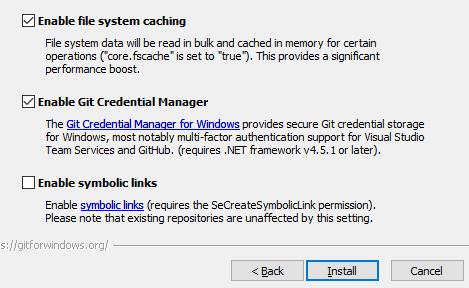

# 
git

## git的维基百科介绍
&nbsp;&nbsp;&nbsp;&nbsp;git是用于Linux内核开发的版本控制工具。与CVS、Subversion一类的集中式版本控制工具不同，它采用了分布式版本库的作法，不需要服务器端软件，就可以运作版本控制，使得源代码的发布和交流极其方便。git的速度很快，这对于诸如Linux内核这样的大项目来说自然很重要。git最为出色的是它的合并追踪（merge tracing）能力。
&nbsp;&nbsp;&nbsp;&nbsp;简单地说，git和SVN的区别即git是分布式版本控制，而CVS、SVN为集中式版本控制。    

***

&nbsp;&nbsp;&nbsp;&nbsp;**git是这样的**
   

***

&nbsp;&nbsp;&nbsp;&nbsp;**svn是这样的**
  
&nbsp;&nbsp;&nbsp;&nbsp;svn因为是集中式，所以就存在单点故障的问题，只要中心服务器出现问题，就不能保证版本的完整性。

## git的下载地址  
&nbsp;&nbsp;&nbsp;&nbsp;[https://git-scm.com/](https://git-scm.com/)  
## git的安装(win64版本为例)  
  

***

**选择默认即可**

**推荐vim编辑器**  
  

**选择最为安全的**  
  

**默认**  

  

  

**点击安装**  
  

***

## git结构  
&nbsp;&nbsp;&nbsp;&nbsp;  **工作区** ===》 **暂存区** ===》 **本地库**  
&nbsp;&nbsp;&nbsp;&nbsp;**（写代码）** **（临时存储）** **（历史版本）**  
